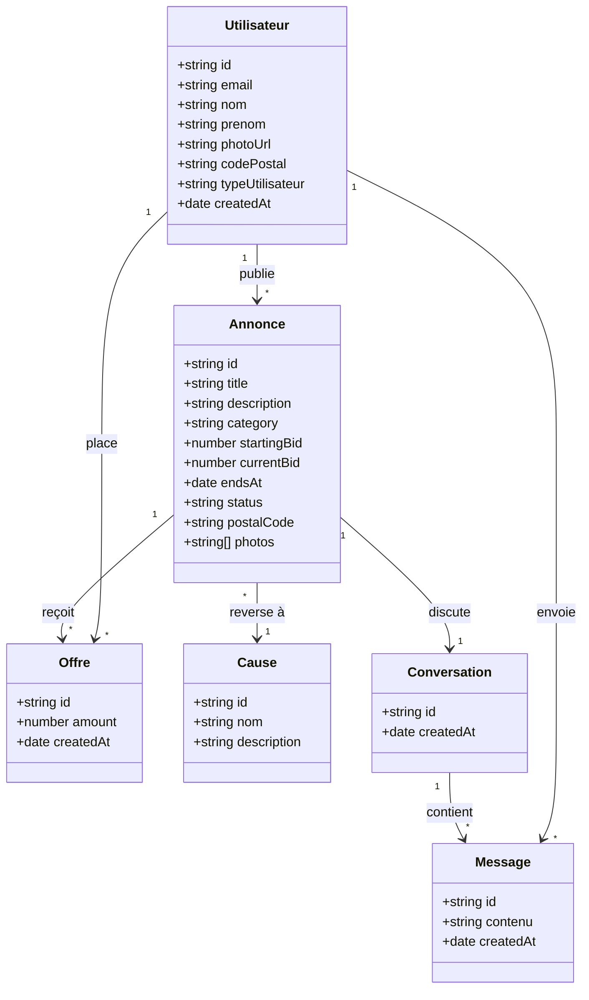

# Modèle de données — DON (enchères caritatives)

Diagramme de classes (à éditer sur mermaidchart.com ou dans l'IDE).

## Notes métier

- Une **Annonce** appartient à un **Utilisateur** vendeur, cible une **Cause**
  caritative, et se termine à une date (`endsAt`).
- Une **Offre** est placée par un enchérisseur ; `currentBid` de l'annonce
  reflète la meilleure offre.
- La **Conversation** lie vendeur et enchérisseur pour organiser le retrait de
  l'objet.
